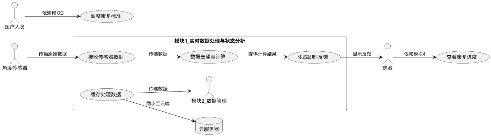

# 本组希望负责的模块

---

### **1. 团队项目用例图（第一版）**
#### **用例图说明**
- **参与者**：患者（主用户）、医疗人员（次要用户）、角度传感器（外部硬件）、云服务器（外部系统）。
- **核心用例**：围绕模块一（实时数据处理与状态分析）的功能展开，并标注与其他模块的交互关系。

#### **用例图（PlantUML 代码，可生成图表）**

---

### **2. 团队负责模块与详细用例**
#### **目标模块**：**模块一 - 实时数据处理与状态分析**  
**选择理由**：  
- 该模块是系统的核心枢纽，直接影响后续模块的数据质量和用户体验。  
- 涉及实时算法优化，技术挑战性强，适合对算法和性能优化有经验的团队。  

---

#### **模块详细用例**
##### **用例1：数据去噪与参数计算**
- **参与者**：角度传感器、患者  
- **描述**：对原始传感器数据进行去噪处理，并计算关节角度、速度、加速度。  
- **前置条件**：传感器已连接并传输数据（模块一已完成）。  
- **后置条件**：生成可用于判定和展示的干净数据。  
- **基本流程**：  
  1. 接收传感器原始数据（100Hz）。  
  2. 应用卡尔曼滤波算法去除噪声。  
  3. 基于滤波后数据计算关节角度（例如膝关节屈伸角度的瞬时值）。  
  4. 通过差分计算速度和加速度。  
  5. 将计算结果暂存至内存缓冲区。  

- **替代流程**：  
  - 若数据频率异常（如低于80Hz），触发警告并尝试重新校准传感器。  

---

##### **用例2：基于机器学习的即时恢复效果判定**

- **参与者**：患者、医疗人员（提供标注数据）、模块二（历史数据）、机器学习模型
- **描述**：使用机器学习二分类模型，实时判断患者动作是否达标（“合格”或“需调整”）。
- **前置条件**：
  1. 数据已完成去噪和参数计算（用例1）。
  2. 历史数据库中已积累足够的标注训练数据（依赖模块二）。
- **后置条件**：生成分类结果并传递至界面模块（模块四）和数据库（模块二）。

###### **基本流程**：

1. **数据准备**：
   - 从模块二（历史数据管理）获取历史康复数据，包括关节角度、速度、加速度及人工标注的“合格/不合格”标签。
   - 对数据进行特征工程（如窗口滑动统计、时间序列特征提取）。
2. **模型训练与更新**：
   - 使用历史数据训练二分类模型（如逻辑回归、随机森林或轻量级神经网络）。
   - 定期（如每天）从模块二获取新数据，更新模型参数（在线学习）。
3. **实时推理**：
   - 接收实时处理后的关节参数（来自用例1）。
   - 提取特征并输入训练好的模型，输出概率值（如“合格概率为85%”）。
   - 根据阈值（如概率≥70%判定为合格）生成分类结果。
4. **反馈生成**：
   - 若判定为“合格”，生成鼓励性提示（如“动作标准，请继续保持！”）。
   - 若判定为“不合格”，提供具体建议（如“膝关节屈伸幅度不足，建议增大10°”）。
5. **数据回传**：
   - 将当前数据及判定结果存储至模块二的数据库，用于后续模型迭代。

###### **替代流程**：

- **冷启动问题**：
  - 若历史数据不足，默认使用规则引擎（基于预设康复标准）临时替代，直至模型训练完成。
- **模型推理失败**：
  - 降级至规则引擎，并记录错误日志。

---

##### **用例3：数据缓存与传递**
- **参与者**：云服务器、其他模块  
- **描述**：缓存处理后的数据，并分发给其他模块（界面、数据库、推荐系统）。  
- **前置条件**：数据已完成处理和判定（用例1、用例2）。  
- **后置条件**：数据被其他模块成功接收。  
- **基本流程**：  
  1. 将处理后的数据按时间戳标记。  
  2. 缓存至内存队列（支持高并发读取）。  
  3. 分发数据：  
     - 实时数据流推送至界面模块（模块四）的3D模型。  
     - 批量数据异步存储至本地数据库（模块二）。  
     - 关键判定结果同步至推荐系统（模块三）。  

- **替代流程**：  
  - 若网络中断，本地缓存数据直至恢复连接。  

---

### **模块开发优先级**
1. **核心算法实现**（用例1）：确保卡尔曼滤波和参数计算的准确性。  
2. **实时反馈机制**（用例2）：影响用户体验和康复效果的直接判定。  
3. **数据分发可靠性**（用例3）：保障其他模块的协作依赖。  

---

### **协作接口需求**
| 接口方向        | 数据格式             | 频率     | 协议/工具          |
| --------------- | -------------------- | -------- | ------------------ |
| 模块一 → 模块四 | JSON（角度、反馈）   | 100Hz    | WebSocket/EventBus |
| 模块一 → 模块二 | 结构化数据（SQL）    | 批量存储 | Room/SQLite        |
| 模块一 → 模块三 | 关键判定结果（文本） | 事件触发 | REST API           |

---

### **团队分工建议**
- **算法组**：专注用例1（去噪与计算），优化卡尔曼滤波性能。  
- **逻辑组**：负责用例2（判定逻辑）与康复标准动态适配。  
- **数据组**：实现用例3（缓存与分发），设计高并发数据管道。  

如果需要进一步细化某个用例或接口设计，可以随时补充！