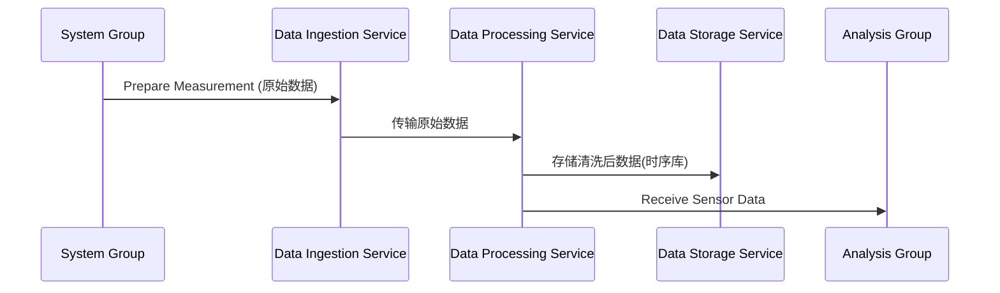
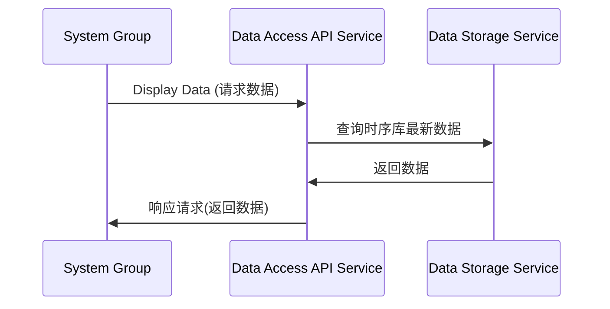
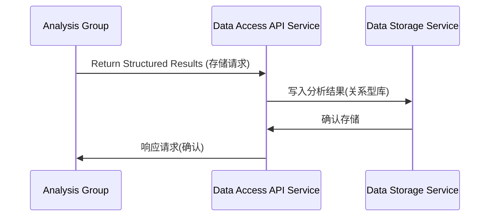
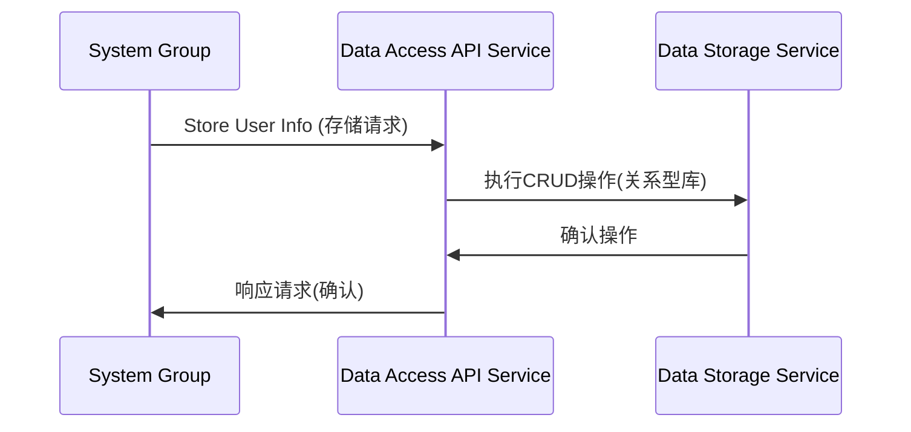
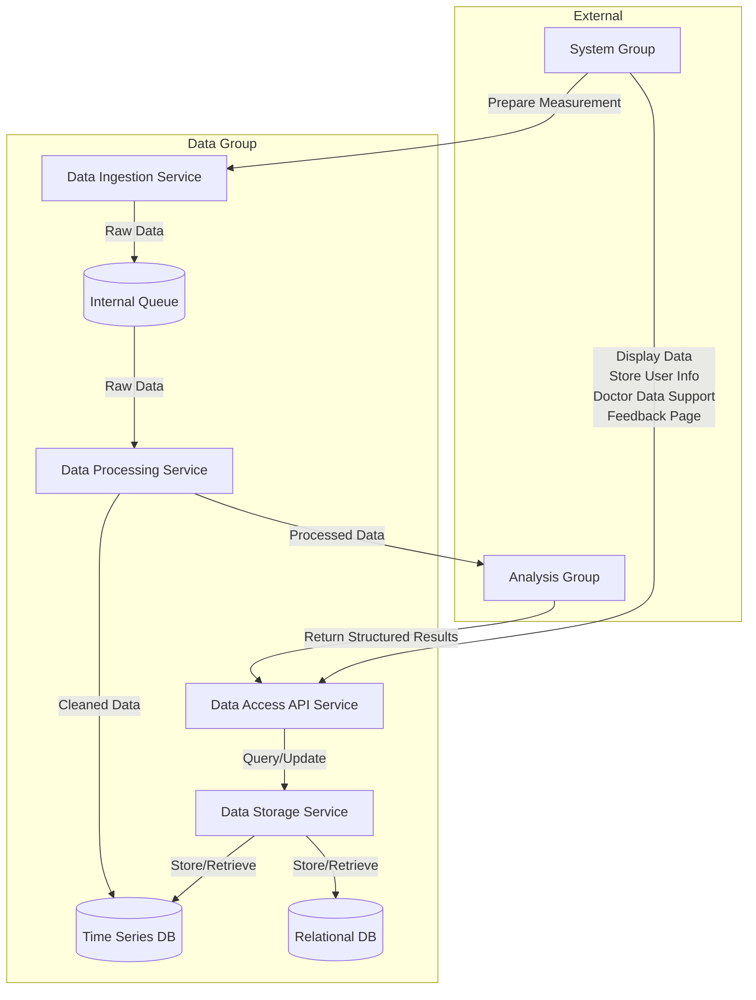

# Data组设计文档

## 核心职责

根据用例图，Data组的核心职责包括：

1. **数据收集** (Data Collection)
   - 从系统层接收原始传感器数据

2. **数据清洗与插值** (Data Cleaning and Interpolation)
   - 处理原始数据，去除噪声，填补缺失值

3. **数据上传/访问** (Data Upload)
   - 提供接口供系统层（如实时显示）访问处理后的数据

4. **数据库管理** (Database Management)
   - 负责将分析结果、反馈等存入数据库，并提供查询接口

5. **数据库CRUD** (Database CRUD)
   - 提供通用的数据库读写接口，用于用户信息、医生信息、系统日志等的存储和管理

## 内部组件/模块设计

### 1. 数据接收服务 (Data Ingestion Service)

**职责**：对应 Data Collection 用例，接收来自 System Group (Prepare Measurement) 的原始传感器数据流。

**逻辑**：
- 提供稳定的API接口（REST, gRPC, 或消息队列入口）接收数据
- 进行初步的数据格式验证和时间戳记录
- 将原始数据快速推送到内部消息队列或直接传递给数据清洗服务

**数据流**：System Group → Data Ingestion Service API → Internal Queue/Data Cleaning Service

**交互**：由 System Group 的 Prepare Measurement 触发调用

### 2. 数据处理服务 (Data Processing Service)

**职责**：对应 Data Cleaning and Interpolation 用例。

**逻辑**：
- 从内部消息队列或 Data Ingestion Service 获取原始数据
- 执行数据清洗算法（例如，滤波去噪）
- 执行数据插值算法（例如，线性插值、样条插值）处理缺失数据点
- 关键交互：将处理后的数据发送到 Analysis Group 进行偏差分析和异常标记
- （可选）将清洗后的数据存入中间存储或直接推送到可供查询的存储层

**数据流**：Internal Queue/Data Ingestion Service → Data Processing Service → Analysis Group (Receive Sensor Data) & Data Storage Service (Cleaned Data)

**交互**：接收来自 Data Ingestion Service 的数据；调用 Analysis Group 的接口

### 3. 数据存储服务 (Data Storage Service)

**职责**：实现 Database Management 和 Database CRUD 的底层逻辑，管理物理或逻辑数据库。

**逻辑**：
- **数据库选型**：
  - 时序数据库 (Time-Series Database, e.g., InfluxDB, TimescaleDB)：用于存储大量传感器时间序列数据
  - 关系型数据库 (Relational Database, e.g., PostgreSQL, MySQL)：用于存储结构化数据
- **CRUD接口**：提供标准的Create, Read, Update, Delete接口
- **数据管理接口**：提供特定接口用于存储和查询分析结果及反馈数据
- **传感器数据存储**：接收处理后数据并写入时序数据库

**数据流**：
- Data Processing Service → Data Storage Service (存储清洗后数据到时序库)
- System Group → Data Access API → Data Storage Service (操作关系型库)
- Analysis Group → Data Access API → Data Storage Service (存储分析结果到关系型库)

**交互**：被 Data Access API 调用

### 4. 数据访问/API服务 (Data Access API Service)

**职责**：作为Data Group对外的统一接口层，处理来自外部的数据请求和写入指令。

**逻辑**：
- 提供API端点（如RESTful API）
- **数据上传/查询**：接收数据请求，查询存储服务，并返回结果
- **数据库管理请求**：接收结果查询或存储请求，并路由到存储服务
- **CRUD请求**：接收用户/医生信息管理请求，并路由到存储服务
- 实现必要的认证和授权逻辑

**数据流**：外部请求 → Data Access API Service → Data Storage Service → Data Access API Service → 外部响应

**交互**：接收外部请求；调用 Data Storage Service

## 内部数据流

### 1. 新测量数据处理流程

### 2. 实时数据显示流程

### 3. 存储分析结果流程

### 4. 用户注册/信息存储流程

### 5. 整体组件关系图

## 关键技术决策点

1. **数据库选择**
   - 时序库 + 关系型库的组合，根据性能和查询需求确定具体实现

2. **内部通信**
   - 服务间可通过直接API调用或引入消息队列（Kafka, RabbitMQ）来解耦

3. **API设计**
   - 设计清晰、一致的RESTful API或gRPC接口供其他组调用

4. **部署**
   - 组件可以容器化（Docker）并通过编排工具（Kubernetes）进行部署和管理

5. **可扩展性**
   - 设计时考虑数据量增长，确保各服务可以独立扩展
